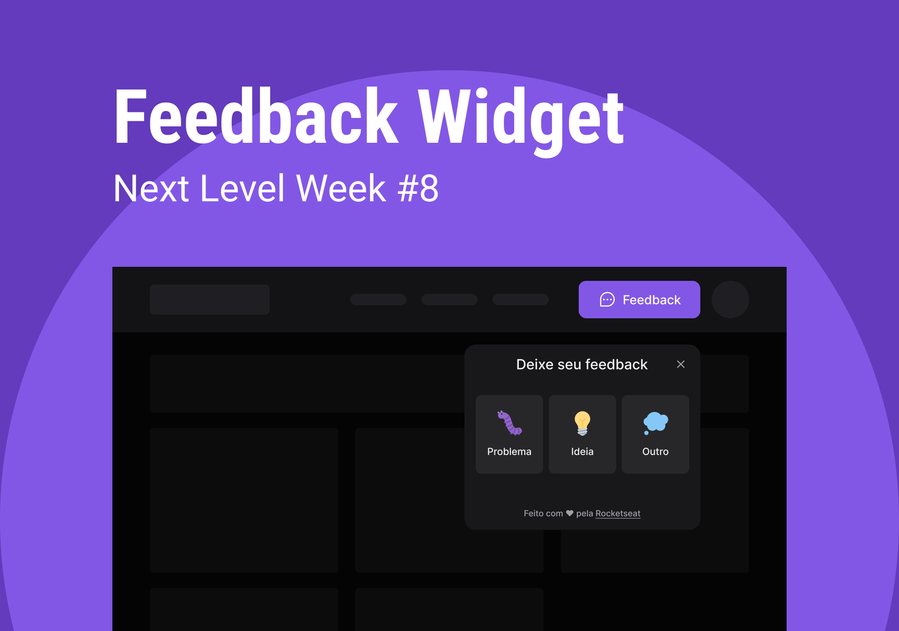

<div align="center">
    
</div>

<h1 align="center">
	Feedget
</h1>

## Project developed at NLW(NextLevelWeek)#8 Return

## 💻 Technologies

- [NodeJS](https://nodejs.org/en/)
- [Yarn](https://yarnpkg.com/)

- [Prisma](https://www.prisma.io/)
- [Express](https://expressjs.com/)

- [ReactJS](https://reactjs.org/)
- [TailwindCSS](https://tailwindcss.com/)
- [React Native](https://reactnative.dev/)
- [Expo](https://expo.dev/)

## 🚀 Installation

```bash
git clone https://github.com/devRMA/NLW-Return.git
cd NLW-Return
```

### Server (backend)

```bash
cd backend
yarn
yarn prisma migrate dev
yarn dev
```

### Web

```bash
cd web
yarn
yarn dev
```

### Mobile

```bash
cd mobile
yarn
expo start
```
